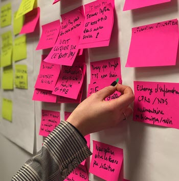

<!DOCTYPE html>
<html>
 <head>
	<title>Rds varma</title>
	
	<link rel="stylesheet" type="text/css" href="jquery.js">
	
	<link rel="stylesheet" type="text/css" href="animate.css">
	<link rel="stylesheet" type="text/css" href="jquery.waypoints.min.js">
	<link rel="stylesheet" href="https://cdnjs.cloudflare.com/ajax/libs/animate.css/4.0.0/animate.min.css"/>
	
 </head>
	
  <body>
  <header>
	 

	   

		  

			  <a herf="" class="logo">Varma</a>
		  

		  

			<ul>
			  <li><a href="#" class="active js-home">Home</a></li>
			  <li><a href="#" class="js-about">About</a></li>
			  <li><a href="#" class="js-skills">Skills</a></li>
			  <li><a href="#" class="js-resume">Resume</a></li>
			  <li><a href="#" class="js-contact">Contact</a></li>
			</ul>
		  

		
	
	   
		 
  </header>
	
	
	<section class="home js-home-section">
	  

		

		  

			

				<h6>Hello, My name is</h6>
			  <h1>R sai Varma</h1>
			  <h3>Web Developer</h3>
			  

				<a href="">View CV</a>
			  

			

		  

		

	   

	</section>
	  
	  
	<section class="about-me js-about-me-section">
	  

	    

		   

			   <h1 class="js-wp-5">About Me</h1>
			   
Information About Me

		   

		

		

		  

			
  
			

			  
			  

			 

			  <h4>I'm Rudraraju Durga Siva Sai Varma</h4>
			  <h6>System Enginner IT services, TCS Kolkata</h6>
			  
I started my carrier in TCS Kolkata as a Fresher, now I'm having 1.5 years of experience in IT industry, worked in TCS as Automation Tester, where we develop and automate the scripts.

			   

				  

				    <label>Birthday:</label>
				    
13th May 1997

				  

				  

				    <label>Email:</label>
				    
rdsvarma94@gmail.com

				  

				  
 
				     <label>Age:</label>
				     
23 Yr

				  

				  

				     <label>Phone:</label>
				     
9490155577

				  

				  

				     <label>Residence:</label>
				     
India

				  

			      

			          <label>Current Location:</label>
				      
Kolkata

				  

		          
  
		              <label>Permanent Address:</label>
				      
Near Yendada super market vizag

				  

		          

		               <label>Present Address:</label>
				       
Newtown Kolkata West Bengal

				  

				 

				 
				 
				 

				  <a class="js-wp-1" href="https://www.facebook.com/rdsv1/" target="_blank"><i class="fa fa-facebook"></i></a>
				  <a class="js-wp-2" href="https://twitter.com/varmaRds/" target="_blank"><i class="fa fa-twitter"></i></a>
				  <a class="js-wp-3" href="https://www.instagram.com/rdsvarma/" target="_blank"><i class="fa fa-instagram"></i></a>
				  <a class="js-wp-4" href="https://www.linkedin.com/in/rds-varma-4324901a9/" target="_blank"><i class="fa fa-linkedin"></i></a>
				 

				 
			  

			

		   

		  
 
	  

	</section>
	  
	  
	<section class="Skills js-skills-section" id="skills">
	  

		

		  

			 

			   

			     <h1 class="js-wp-6">professional Skills</h1>
				 
I have ceritifications in Html, CSS and java Script and for the Python, not only the ceritifications i had hands on experience in these cources.

				 

			  

			  
		      

				  
			    

				  <h6>HTML</h6>
				  

					

					  92%
					

				  

				

			    

				  <h6>CSS</h6>
				  

					

					  75%
					

				  

				

				

				  <h6>Java Script</h6>
				  

					

					  80%
					

				  

				

				

				  <h6>Python</h6>
				  

					

					  90%
					

				  

				

				

				  <h6>SQL</h6>
				  

					

					  60%
					

				  

				
 
			  

			

			
		   

			   
			

			
		  

		

	  </section>  
	  
	  
	  
	    <section class="resume js-resume-section" id="resume">
	    

			
			

				

					<h1 class="js-wp-7">Resume</h1>
				

			

			
			

				

					
Currently working as QA Engineer for top MNC, these are a few of the things that I've been working on lately:

					    
				
					
       
						

						 <h2 class="js-wp-13">Experience</h2>
						

						
						

						<h2>Tata Consultancy Services</h2>
						<h4>November 2018 - Present</h4>
						

						
						
						

					     <ion-icon name="medkit-outline"></ion-icon>	
						

						
						

						 <h2>Analyst - Test Automation<h2>
						 
Involved in design and development of automation frameworks like fitnesse using Selenium Webdriver. Analysis of test requirement and automation feasibility.

						 <h2>Manual - Test Automation</h2>
						 
Looking functionalits of various applications. From application perspective will check each and every functions of memu and sub menu.

						 <h2>Test script maintainence</h2>
						 
The maintaince of the test cases is done using ALM & Jira, Where we used to track the number of test cases present in the projrct and maintained the automation job in Jenkins

						
 
				     

				
					
       
						

						 <h2 class="js-wp-14">Education</h2>
						

						
						 

							 
						   
<h2>Certificates</h2>

						   

Ongoing

							 
						   
<h2>Bachelor's Degree</h2>

						   

B-Tech June 2014 - May 2018

						

							
						

						<ion-icon name="school-outline"></ion-icon>
						

						
						

						<ion-icon name="school-outline"></ion-icon>
						

						
						

						   
							<h2>Udemy</h2>
						    
Courses taken or in-progress include Python3. Build responsive real world website with HTML5, CSS3 and JQuery.  The complete JavaScript cource 2020 with Build real projets.

							
							<h2>Gitam university</h2>
							
B.Tech. in Electronics and Communication Engineering(ECE).

						
 
				     
				
			  

			

			
		  

	  </section>
			
		<section class="contact js-contact-section" id="contact">
			

				

					
					

						<h1 class="js-wp-10"><a href="https://www.google.com/maps/place/Krishna+Ashirbad+Co+Operating+Housing+Society/@22.574984,88.4696882,19z/data=!3m1!4b1!4m13!1m7!3m6!1s0x3a027700689f1bcb:0x5c208795ec7114ce!2sKolkata,+West+Bengal!3b1!8m2!3d22.5402602!4d88.3821989!3m4!1s0x3a02752f9145cdad:0x74d3e720d6a64b70!8m2!3d22.5749825!4d88.4702356" target="_blank"><ion-icon name="location-outline"></ion-icon></a></h1>
						
New town Kolkata 700156

					

					

						<h1 class="js-wp-11"><a href="mailto: rdsvarma94@gmail.com"> <ion-icon name="mail-open-outline"></ion-icon></a></h1>
						
rdsvarma94@gmail.com

					

					

						<h1 class="js-wp-12"><a href="tel:+91 9490155577"><ion-icon name="call-outline"></ion-icon></a></h1>
						
Phone (+91) 9490155577

					

					
				    

				     <a href="https://www.facebook.com/rdsv1/" target="_blank"><i class="fa fa-facebook"></i></a>
				     <a href="https://twitter.com/varmaRds/" target="_blank"><i class="fa fa-twitter"></i></a>
				     <a href="https://www.instagram.com/rdsvarma/" target="_blank"><i class="fa fa-instagram"></i></a>
				     <a href="https://www.linkedin.com/in/rds-varma-4324901a9/" target="_blank"><i class="fa fa-linkedin"></i></a>
				     
				    

					
				

			

			</section>
			
			
			
			
	
	
    
    
    
    
    
    
    
  </body>
</html>
